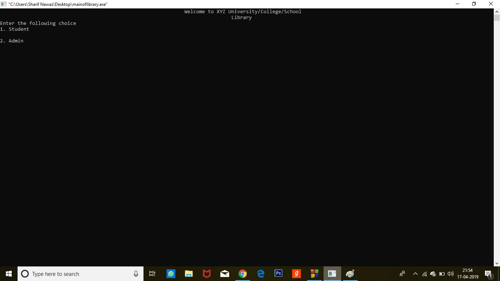
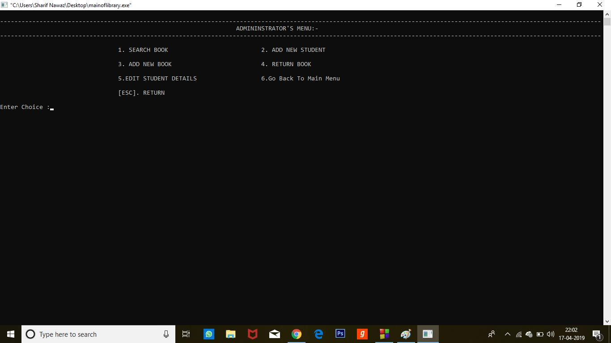
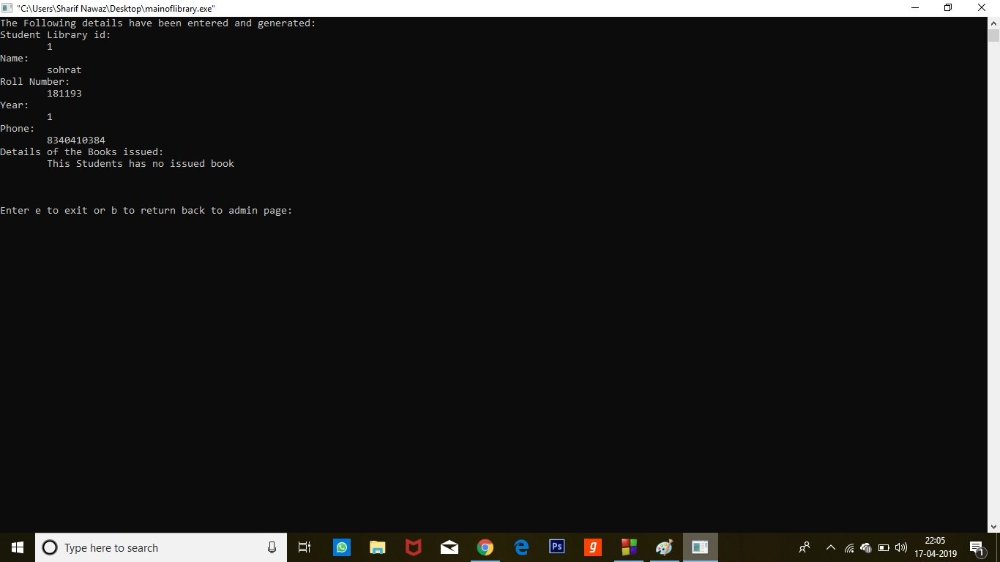
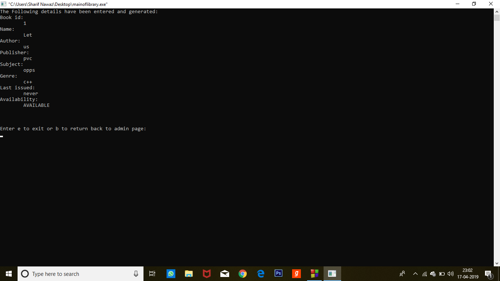
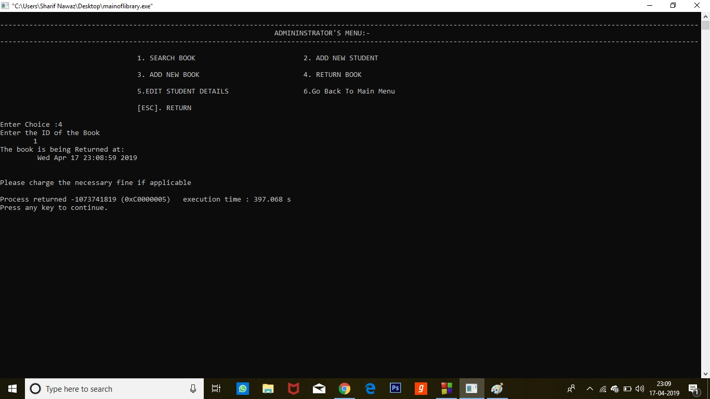

# LIBRARY MANAGEMENT SYSTEM

**It is Library Management System developed in C++ programming language which works completely as a real world library.

**It is developed by the Three Amigos

* Shubham Kumar Singh (181B211)

* Sharif Nawaz (181B193)

* Arpit Verma (181B049)

 In this library all things are included from issuing a book to returning the book.

 It has two pannels i.e, Admin and another Student.

 It has two menu 

**Let's go and check the Admin Pannel, to enter as a Admin you're required a passcode i.e, "admin@123" .

It's Admin menu 

**Now, let's add a student 

Adding New book 

Let's search the book  

If the student has issued the book now it's time to return and admin have it's returning rights and it also calculate fine if the student is not returning the book on due date  

Now after whole process and seeing the working of library let's go to the main menu 

After moving to Students menu we have three options i.e. search books 
Next issue the book and time and date will be recorded so that there will be no issue for imposing fine 
If students or anybody doesn't find it's desired book they can request from library's admin 
